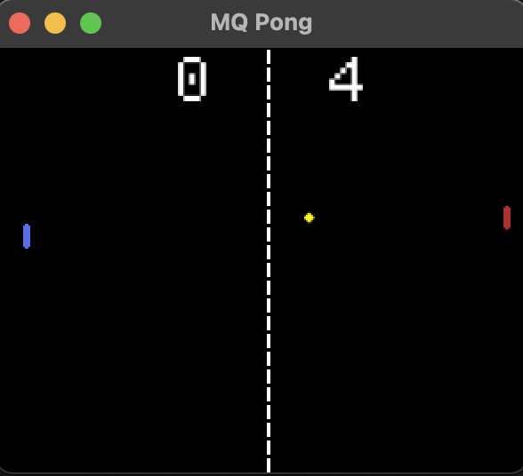

### Macroquad Pong

Super simple Pong implementation written in Rust, using the Macroquad crate.

Using this to learn the basics of Macroquad, and Rust at the same time. Ignore the bad conventions.

Current limitations:
- It's impossible to win, as the "AI" is currently perfect
- No game states, so the game starts and never ends
- Some bugginess around paddle bounces in certain circumstances
  - I'm using simple Rect overlaps for collision, as it was fast and easy, so some weirdness occurs

All Assets were created by me for this project. Feel free to use them however you see fit.
